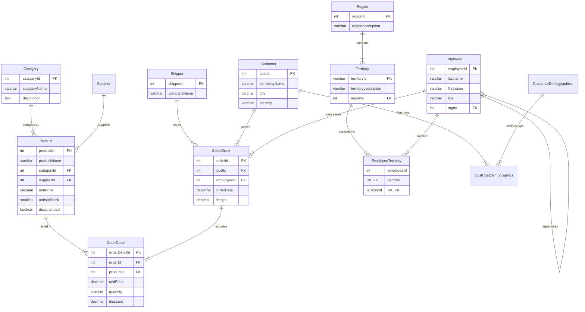

# 🗄️ Gastro-Savdo Insights - Database Schema

Ushbu hujjat "Gastro-Savdo Insights" loyihasining ma'lumotlar bazasi tuzilishini to'liq tasvirlaydi. Baza **Northwind** sxemasiga asoslangan va zamonaviy talablarga moslashtirilgan.

---

## 🗺️ Entity Relationship Diagram (ERD)

Quyida ma'lumotlar bazasining vizual tuzilishi va jadvallar o'rtasidagi bog'liqliklar keltirilgan.

## 📋 Jadvallar Tavsifi (Data Dictionary)

### 1. Asosiy Biznes Ma'lumotlari (Master Data)

#### `Category`

Mahsulot kategoriyalari.
| Ustun | Turi | Tavsif |
| :--- | :--- | :--- |
| **categoryId** | INT (PK) | Unikal identifikator. |
| `categoryName` | VARCHAR(15) | Kategoriya nomi (masalan: Beverages, Seafood). |
| `description` | TEXT | Kategoriya haqida qisqacha ma'lumot. |
| `picture` | BLOB | Kategoriya rasmi. |

#### `Product`

Sotiladigan mahsulotlar ro'yxati va ular haqida texnik ma'lumotlar.
| Ustun | Turi | Tavsif |
| :--- | :--- | :--- |
| **productId** | INT (PK) | Unikal identifikator. |
| `productName` | VARCHAR(40) | Mahsulot nomi. |
| `supplierId` | INT (FK) | Yetkazib beruvchi (`Supplier` jadvaliga havola). |
| `categoryId` | INT (FK) | Kategoriya (`Category` jadvaliga havola). |
| `quantityPerUnit` | VARCHAR(20) | O'lchov birligi (masalan: 10 boxes x 20 bags). |
| `unitPrice` | DECIMAL(10,2) | Donasining narxi. |
| `unitsInStock` | SMALLINT | Ombordagi mavjud qoldiq. |
| `unitsOnOrder` | SMALLINT | Buyurtma qilingan, lekin hali kelmagan miqdor. |
| `reorderLevel` | SMALLINT | Qayta buyurtma berish darajasi (minimal qoldiq). |
| `discontinued` | CHAR(1) | '1' = Sotuvdan olingan, '0' = Faol. |

#### `Supplier`

Mahsulot yetkazib beruvchi kompaniyalar.
| Ustun | Turi | Tavsif |
| :--- | :--- | :--- |
| **supplierId** | INT (PK) | Unikal identifikator. |
| `companyName` | VARCHAR(40) | Kompaniya nomi. |
| `contactName` | VARCHAR(30) | Mas'ul shaxs ismi. |
| `contactTitle` | VARCHAR(30) | Mas'ul shaxs lavozimi. |
| `address`, `city` | VARCHAR | Manzil va shahar. |
| `region`, `postalCode` | VARCHAR | Mintaqa va pochta indeksi. |
| `country` | VARCHAR(15) | Mamlakat (ta'minot zanjiri tahlili uchun muhim). |
| `phone`, `fax` | VARCHAR | Aloqa ma'lumotlari. |
| `HomePage` | TEXT | Veb-sayt manzili. |

#### `Shipper`

Buyurtmalarni yetkazib beruvchi transport kompaniyalari (Logistika).
| Ustun | Turi | Tavsif |
| :--- | :--- | :--- |
| **shipperId** | INT (PK) | Unikal identifikator. |
| `companyName` | VARCHAR(40) | Tashuvchi kompaniya nomi. |
| `phone` | VARCHAR(44) | Telefon raqami. |

---

### 2. Savdo va Buyurtmalar (Sales Transactions)

#### `SalesOrder` (Asl nomi: Orders)

Buyurtmalarning "sarlavha" qismi (kim, qachon, qayerga).
| Ustun | Turi | Tavsif |
| :--- | :--- | :--- |
| **orderId** | INT (PK) | Unikal buyurtma raqami. |
| `custId` | INT (FK) | Buyurtmachi (`Customer`). |
| `employeeId` | INT (FK) | Buyurtmani rasmiylashtirgan xodim (`Employee`). |
| `orderDate` | DATETIME | Buyurtma sanasi. |
| `requiredDate` | DATETIME | Talab qilingan yetkazish sanasi. |
| `shippedDate` | DATETIME | Haqiqiy yetkazilgan sana (NULL agar hali jo'natilmagan bo'lsa). |
| `shipperid` | INT (FK) | Yuk tashuvchi (`Shipper`). |
| `freight` | DECIMAL(10,2) | Yuk tashish narxi (logistika xarajati). |
| `shipName`, `shipAddress`... | VARCHAR | Yukni qabul qiluvchi ma'lumotlari. |
| `shipCountry` | VARCHAR(15) | Yuk yetkazilgan mamlakat (Hududiy tahlil uchun). |

#### `OrderDetail`

Buyurtma tarkibi, ya'ni chekdagi har bir qator.
| Ustun | Turi | Tavsif |
| :--- | :--- | :--- |
| **orderDetailId** | INT (PK) | Unikal qator identifikatori. |
| `orderId` | INT (FK) | Qaysi buyurtmaga tegishliligi. |
| `productId` | INT (FK) | Sotilgan mahsulot. |
| `unitPrice` | DECIMAL(10,2) | Sotuv paytidagi narx (Mahsulotning joriy narxidan farq qilishi mumkin). |
| `quantity` | SMALLINT | Miqdor. |
| `discount` | DECIMAL(10,2) | Chegirma foizi (0 dan 1 gacha, masalan 0.15 = 15%). |

---

### 3. Mijozlar va Aloqalar (CRM)

#### `Customer`

Mijozlar (kompaniyalar) bazasi.
| Ustun | Turi | Tavsif |
| :--- | :--- | :--- |
| **custId** | INT (PK) | Unikal identifikator. |
| `companyName` | VARCHAR(40) | Kompaniya yoki shaxs nomi. |
| `contactName` | VARCHAR(30) | Aloqa uchun shaxs. |
| `contactTitle` | VARCHAR(30) | Aloqa shaxsining lavozimi. |
| `city`, `country` | VARCHAR | Joylashuv (Davlatlar kesimida tahlil uchun). |
| `phone`, `fax` | VARCHAR | Telefon va faks. |

#### `CustomerDemographics` & `CustCustDemographics`

Mijozlarni turlarga ajratish uchun qo'shimcha jadvallar.

- **CustomerDemographics**: Mijoz turlari tavsifi (`customerDesc`).
- **CustCustDemographics**: Mijoz va tur o'rtasidagi bog'lovchi jadval.

---

### 4. Xodimlar va Tashkiliy Tuzilma (HR)

#### `Employee`

Kompaniya xodimlari. O'z-o'ziga bog'lanish (Self-Reference) orqali boshqaruv ierarxiyasini tashkil qiladi.
| Ustun | Turi | Tavsif |
| :--- | :--- | :--- |
| **employeeId** | INT (PK) | Unikal identifikator. |
| `lastname`, `firstname` | VARCHAR | Ism va Familiya. |
| `title` | VARCHAR(30) | Lavozim. |
| `titleOfCourtesy` | VARCHAR(25) | Murojaat shakli (Mr., Ms., Dr.). |
| `birthDate`, `hireDate` | DATETIME | Tug'ilgan va ishga kirgan sanalar. |
| `mgrId` | INT (FK) | Rahbarning IDsi (Boshqa `employeeId` ga ishora qiladi). |
| `photo` | BLOB | Xodim rasmi. |
| `notes` | BLOB | Xodim haqida qo'shimcha izohlar. |
| `photoPath` | VARCHAR(255) | Rasmga havola (agar rasm faylda saqlansa). |

#### `Region`

Yirik geografik mintaqalar (masalan: Western, Eastern).
| Ustun | Turi | Tavsif |
| :--- | :--- | :--- |
| **regionId** | INT (PK) | Unikal identifikator. |
| `regiondescription` | VARCHAR(50) | Mintaqa nomi. |

#### `Territory`

Xodimlar biriktirilgan aniq hududlar (Shaharlar, tumanlar).
| Ustun | Turi | Tavsif |
| :--- | :--- | :--- |
| **territoryId** | VARCHAR(20) (PK) | Hudud kodi (raqam emas, string bo'lishi mumkin). |
| `territorydescription` | VARCHAR(50) | Hudud nomi (New York, Boston va hk). |
| `regionId` | INT (FK) | Qaysi mintaqaga tegishliligi. |

#### `EmployeeTerritory`

Xodim va Hudud o'rtasidagi ko'pga-ko'p (Many-to-Many) bog'liqlik jadvali. Bir xodim bir necha hududga javob berishi mumkin.

- `employeeId`: Xodim identifikatori.
- `territoryId`: Hudud identifikatori.

---

### 5. Tizim va Xavfsizlik

#### `admins`

Veb-ilova administratorlari va foydalanuvchilari.
| Ustun | Turi | Tavsif |
| :--- | :--- | :--- |
| **adminId** | INT (PK) | Unikal admin ID. |
| `username` | VARCHAR(50) | Tizimga kirish logini. |
| `password_hash`| VARCHAR(255)| Shifrlangan parol. |
| `first_name`, `last_name` | VARCHAR | Ism va familiya. |
| `telegram_id` | VARCHAR(20) | 2FA autentifikatsiya uchun Telegram ID. |
| `phone_number` | VARCHAR(20) | Telefon raqami. |
| `created_at` | DATETIME | Yaratilgan vaqt. |
